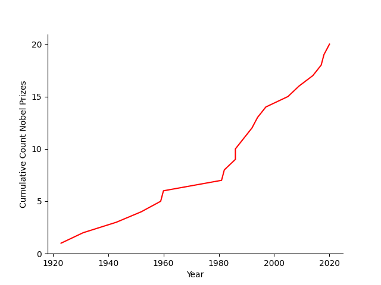

.. _blog:

=====================
David Ollodart's Blog
=====================

Welcome to my website. My writings are on STEM, STEM education, STEM history, and technology for applications in science laboratories.

Motivation
----------
The theory of chemical engineering was in bulk developed in the 19th century (thermodynamics, chemical kinetics, and continuum mechanics), with substantial additions in the early 20th (formalization of chemical kinetics into the science of transition state theory and then to chemical reaction engineering, formalization of continuum mechanics into the science of transport phenomena, advent of polymer science). 

Improved experimentation is the modern challenge, especially interdisciplinary experiments which require innovative experimental apparatus. 

The cumulative count of Nobel prizes awarded to analytical tools and techniques is steeply increasing: 

- 1923: Chemistry for Micro-Analysis of Organic Substances
- 1931: Chemistry for Chemical High Pressure Methods
- 1943: Chemistry for Isotope Tracer Studies
- 1952: Chemistry for Partition Chromatography
- 1959: Chemistry for Polarographic Methods
- 1960: Chemistry for Carbon-14 Age Determination
- 1981: Physics for High-Resolution Electron Spectroscopy and Laser Spectroscopy
- 1982: Chemistry for Crystallographic Electron Microscopy
- 1986: Chemistry for Electron Microscopy Optics and Scanning Electron Microscopy
- 1986: Physics for Electron Optics and Scanning Tunneling Microscopy 
- 1989: Physics for Atomic Clocks and Ion Traps
- 1992: Physics for Invention and Development of Particle Detectors
- 1994: Physics for Neutron Spectroscpy and Diffraction
- 1997: Physics for Laser Cooling and Trapping
- 2005: Physics for Laser-Based Precision Spectroscopy
- 2009: Physics for Fiber Optics and Imaging Semiconductor Circuit
- 2014: Chemistry for Super Resolved Fluorescent Microscopy 
- 2017: Chemistry for Cryo-Electron Microscopy
- 2018: Physics for Laser Optical Tweezers and Laser High Intensity Ultra-Short Optical Pulses
- 2020: Chemistry for CRISPR/Cas9 Genetic Scissors

The field of chemical engineering is growing more interdisciplinary. This is evidenced by the large fraction, indeed majority, of the top 100 Chemical Engineers who do interdisciplinary research, as published by AICHE.

The field of chemical engineering has a growing problem of unreproducible results, which I can't substantiate with data, only having been informed in lectures that this is the case. I also do not know relative to other fields if the problem is greater or if it is growing at a greater rate. In any case, the problem exists, and the solution is not totally field specific.

To address the modern challenge and the reproducibility problem, laboratories should be outfitted with extensive open source hardware, including sensors for ambient conditions and system and instrument conditions. These should be operated in controls by open-source software with data analyzed and archived by open-source software. There is evidently a need for the kind of bending over backwards Richard Feynman advised in his 1974 commencement address to Princeton on Cargo Cult Science. FOSS hardware and software are the means to meet the need.

There is a growing interest in machine learning and then artificial intelligence. Yet many laboratories, even those in high-ranking universities and technical disciplines, are not yet up to speed with the current information management and controls technology. There is more to be gained, more easily, only by making existing technologies easier to implement, as examples:

- Information management that is meant only for human beings to analyze, beyond the handwritten paper notebook, such as ditigal notebooks and data archiving. 
- Controls which use PID routines for experimental variables such as pressure and temperature which run well-established auto-tune procedures.

I suspect the growth of consulting firms in chemical engineering, which was the largest growing sector in the mid 2010s, is mostly due to an inability of the industry to implement well-established best practices. Unlike industry, university labs cannot afford consultants, and so this is an attempt to provide practical advice to implement well-established practices. The posts in this blog should assist a novice student with implementing open source hardware and software. Nothing here is functionally more advanced than what exists and is implemented in some parts, usually high-tech, of industry. The emphasis is on low cost and ease of implementation.

The Need for Liberalization

External Links
--------------
Resources I have found useful:

- `Tera Labs`_: At-home physics experiments in vacuum, electricity and magnetism. These at-home experiments show the fundamental physics behind apparatus.
- `The Linux Documentation Project`_: In particular see the Linux Serial HOWTO in the linux documentation project. All links to the "Linux Lab Project" started by Claus Schroeter of Berlin's Freie Universitaet are broken, which would be most relevant. However guides on networking and serial communications are valuable.
- `Martindale Center`_: Website maintained full-time by a former consultant with links to calculators for many applications.

.. _`The Linux Documentation Project`: https://www.tldp.org
.. _`Tera Labs`: http://www.teralab.co.uk
.. _`Martindale Center`: https://www.martindalecenter.com

Internal Links
--------------

.. toctree::
   :maxdepth: 1

   posts/posts
   contact
   how-this-was-made
   foss-alternatives
   why-should-foss-controls-be-possible

