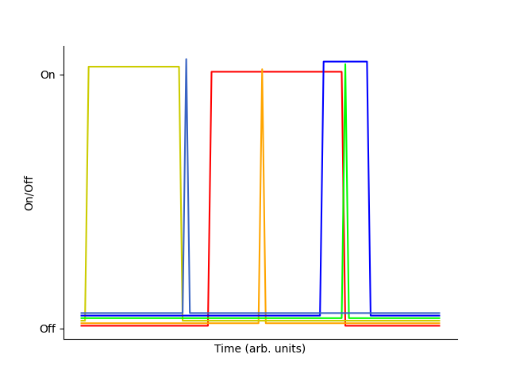

.. _terminal:

Terminal I/O
============

This post is about terminal emulator input from a keyboard, especially
in analogy to program inputs from text files. It doesn't discuss the
technical details of how terminal emulators work. For that, I recommend
`this blog post on tty (teletype terminal)`_.

.. _`this blog post on tty (teletype terminal)`: http://www.linusakesson.net/programming/tty/

Notation
--------

- A plus sign (+) means hold previous key(s) to make a key combination.

- A comma (,) means release previous key(s) to make a key sequence.

- Keys are all lowercase, like :kbd:`a` and :kbd:`ctrl`. For multi-word
  keys, lower camel case is used, like :kbd:`capsLock`.

- Since keyboard shortcuts are case-sensitive, e.g., typing :kbd:`ctrl` +
  :kbd:`v`, :kbd:`ctrl` + :kbd:`u` is different than :kbd:`ctrl` + :kbd:`v`,
  :kbd:`ctrl` + :kbd:`shift` + :kbd:`u` in Vim's insert mode, keyboard
  characters which can have different case are typed with explicit shift to
  show case change. Even though keycaps for latin letters are usually capital,
  lowercase is used. 

- ASCII characters are shown by three fields: the word ASCII, a two
  hex-igit hexadecimal value for the code with base indicated by a preceding
  0x, and the 1967 standard abbreviation. For example, ASCII 0x00 NUL
  is the null character. While non-printable encodings are sometimes called
  codes, that distinction isn't made here unless necessary.

- Both backslash escaped charactesr like ``\n``, ``\r``, ``\t`` and carat notation
  ``^J``, ``^M``, ``^I`` are used to represent non-printable characters.

- All the given keyboard shortcuts are for a system with the following in ``/proc/version``:

::

    Linux version 5.4.0-66-generic (buildd@lgw01-amd64-039)
    (gcc version 9.3.0 (Ubuntu 9.3.0-17ubuntu1~20.04))
    #74-Ubuntu SMP Wed Jan 27 22:54:38 UTC 2021

Definitions
-----------

Some of the definitions here are non-standard, but are easily defined in terms of standard definitions:

- Meta keys: The set of what are conventionally called modifier and system
  keys. The better word might be "escape keys", since they do the analogous
  thing to a backslash or other escape character. However, since there is
  already an :kbd:`esc`, that name is not chosen. The meta keys are
  :kbd:`ctrl`, :kbd:`alt`, :kbd:`shift`, and :kbd:`super`, and are not
  capitalized. 

- (Named) function keys: Function keys are :kbd:`F1`-:kbd:`F12`, while named
  function keys are like :kbd:`enter` and :kbd:`delete`. The combination are
  referred to as (named) function keys. Again, the better word might be
  "control keys", since they do the analogous thing to a control character.
  However, since there is already an :kbd:`ctrl`, that name is not chosen.

- Literal: When about an input at the terminal, the input of the single
  character bound to a key as shown by the keytop. For example, the key
  :kbd:`q` is literal only when it inputs the character ``q``. If it
  inputs the character ``Q`` combination with shift, or causes a program
  to quit it is non-literal. Note by this definition control characters
  could be literally input. However, there are no keys for control
  characters.

  When about an input to a program from a script text file, literal is a
  property of the character by the parsing of the program. For example,
  the backslash may be non-literal in a text file, even though of course
  its representation in that text file is literal.

- Keyboard shortcut: Any key, key combination, or key sequence which
  results in non-literal input is a keyboard shortcut.

- Control character: Any of the non-printable characters in the ASCII
  standard (this is a standard term).

- Visual: Any character which affects the visual display. This includes
  all printable characters and some non-printable characters like line
  feed (ASCII 0x0A LF) and horizontal tab (ASCII 0x09 HT), while excluding
  some non-printable characters like bell (ASCII 0x07 BEL).

- Terminal: Unless otherwise specified, a terminal emulator like ``xterm`` or ``screen``.

.. _what-can-be-input: 

What can be Input?
------------------

OSs can tell the duration between events: there is a difference between
two single-clicks and a double-click on a mouse, for example. When using
a keyboard to input, there is therefore in addition to the different
key combinations key and key combination sequences, and are also
overlapping key press, key state, and key release. In press-and-release,
you can hold some key(s) while inputting any sequence of keys and key
combinations, and release those key(s) at any time.

In mathematical language, any number of delta and step functions in
time, each labeled with a letter or symbol of the key it correpsonds to,
can be used as an input. In math notation, this is a set of functions

.. math::

    \{d({\rm A}, t-t_0),d({\rm B}, t-t_1),S({\rm C}, t-t_2),S({\rm D}, t-t_3),\ldots\}

where :math:`d` is the delta function, :math:`S` is the step function,
and you can consider the times as :math:`t_0 < t_1 < \ldots`. Button
press, hold, and release is a difference in step functions. That can be
represented in the mathematical notation by :math:`\{S({\rm A}, t-t_0),
-S({\rm A}, t-t_1)\}`.

Terminal input doesn't, as far as I know, use anything beyond a key
combination. That is, key combination is recognized once the keys are pressed
at the same time. Beyond that, the terminal does not keep a track of key press
history, inputting literal keys one-by-one and forgetting them after each
stroke. 

General Input Method for Music and Games
~~~~~~~~~~~~~~~~~~~~~~~~~~~~~~~~~~~~~~~~

A short aside follows. The input method described above is used to make music.
Music is different starting points and durations in its rhythm and different
keys in the pitches and so is fully described by this input method. That is,
you can reduce a piece of music to the same set of labeled delta and step
functions just given in :ref:`what-can-be-input` (caveat: some music phenomena
like the trombone glissando when a trombone slide is continuously moved would
require an infinite number of delta functions since the pitch varies
continuously). Since keyboards were first made to play percussion-like
instruments such as the piano, this analogy is especially pleasing. 

As a very simple form of music, phones often associate a pitch to each number,
which in turn are assigned to (on average) 3 characters of the alphabet each,
leading to a basic type of music, with pitch but without harmony and without
regular rhythm, when a phone number is dialed.  

The same input method is used for some video games,
too. There is the famous Konami code key sequences
↑,↑,↓,↓,←,→,←,→,B,A. Video games can also require key
combination sequences for pressing buttons at the same time, and key
states for holding a button while other buttons are being pressed.

A visualization of a randomly generated key combination sequence is given below
with vertical offset for clarity (generating file here: :download:`vis.py`).

What are keyboard shortcuts used for?
-------------------------------------

Keyboard shortcuts are used to make programs take an action that can be as
complicated as required, though usually the shortcuts are for simple actions
(you can take a look at callback functions in any user interface program source
to see how complicated they usually are). The default action of a key is to
input a literal character, and this is called literal input. This is limited to
a terminal: of course in video games and other applications keys like :kbd:`a`
often do something much different than input an ``a`` character into any text
buffer. However, the only program other than a terminal talked about here is a
text editor ran in a terminal, which is highly similar (for the modal editor
Vim, the similarity exist when Vim is in insert mode).

Keyboard shortcuts are used for making non-literal input, usually
commands. Another non-literal input is to insert some literal
character(s), but that application appears to be rare. Still, it is
illustrated in :ref:`terminal-program-example`. By this definition, even
the :kbd:`enter` key is a keyboard shortcut (see :ref:`in-terminals`).

Keyboard shortcuts have different meanings in different programs,
but since the kernel interprets all of them, and passes them through
other parent programs, like a shell in which an interpreter is running,
a non-literal meaning of a keyboard shortcut can be processed by any
higher level process than the active program.

In summary, keyboard shortcuts are used for:

- Inputting literal characters not present on keyboards. In Vim, the keyboard
  shortcut in insert mode of :kbd:`ctrl` + :kbd:`v`, :kbd:`u`, :kbd:`<d>`,
  :kbd:`<d>`, :kbd:`<d>`, :kbd:`<d>` will input any 4 hex-igit Unicode
  character, and :kbd:`ctrl` + :kbd:`v`, :kbd:`shift` + :kbd:`u`, :kbd:`<d>`,
  :kbd:`<d>`, :kbd:`<d>`, :kbd:`<d>`, :kbd:`<d>`, :kbd:`enter` will input any 5
  hex-igit codepoint Unicode character, where :kbd:`<d>` is a hex-igit. This
  works for printable and non-printable characters. This is relatively "rare"
  in the sense there are few shortcuts which do it.

- Executing commands in a program. These are program specific. Because Vim's
  normal mode executes commands on input, it actually has few shortcuts in
  input mode. A better text editor example is Emacs, where every action is a
  keyboard shortcut, like moving the cursor between lines and characters.  The
  large majority of keyboard shortcuts execute some commands other than
  inserting some character. In the terminal proper, like the command line,
  there are fewer commands to be executed. The commands which are executed are
  often analogous to ASCII control characters, like :kbd:`ctrl` + :kbd:`c`
  meaning to quit a program because ASCII 0x03 ETX (see again
  :ref:`in-terminals`).

- Controlling the operating system. This can be thought of as just the highest
  level program which is always running. For example, :kbd:`ctrl` + :kbd:`alt`
  + :kbd:`del` at the time of this writing on a Debian distribution logs a user
  out.

Modal or Context Dependant Input
~~~~~~~~~~~~~~~~~~~~~~~~~~~~~~~~

The result of a keyboard shortcut depends on which program is active as just
discussed. This can be called modal or context dependant input. Modal input is
most exploited on simple digital devices like modern thermostats because of the
limited number of keys available for input. For example, there may be a
super-level key combination to return to a home screen from anywhere, or a
press-and-hold key to return to a homescreen. From that homescreen there may be
a key combination to enter a menu or a mode. In a menu or mode, some keys, like
an up and down arrow, may be used for navigation. To edit a field in that menu
or mode, you might press up and down arrow at the same time. Then you can
adjust the value with the arrows, and exit and save the setting with another
double press of the up and down arrow. Since even the same program can have
different program contexts, in the windows it makes available, modal input as a
general concept is useful to know, even though on a computer it is much easier
to escape program context and the number of available keys makes conflicts much
easier to avoid.

By context switching here I mean which program is currently "active" and
controlling your input and display, not the process of storing a state of a
process or thread in operating system design. Whenever you are in a program
context, that program has control over your input and at least part of your
display. A pathological program can make it difficult to "get out", like what
can happen in a browser full screen mode. But since the kernel interprets the
keyboard intermediate to the program, there are control sequences that will
always be interpreted by the kernel. One of these is :kbd:`alt` + :kbd:`f4` to
kill the program, which is necessary in case the program is consuming too many
resources and possibly going to crash the OS.  :kbd:`alt` + :kbd:`f1` lets you
escape to another program context without killing the current program, a good
thing in case there is data in the program buffer you don't want lost.

.. _how-keyboard-shortcuts:

How do you Know Keyboard Shortcuts?
-----------------------------------

Usually, programs will give you keyboard shortcuts (also called hotkeys) in a
manual. Otherwise, they may follow a standard like the Common User Access. The
general trial-and-error approach to finding a shortcut is trying some input for
the generic :kbd:`key` in the following meta combinations:

- :kbd:`ctrl` + :kbd:`key`
- :kbd:`alt` + :kbd:`key`
- :kbd:`ctrl` + :kbd:`shift` + :kbd:`key`
- :kbd:`alt` + :kbd:`shift` + :kbd:`key`
- :kbd:`ctrl` + :kbd:`alt` + :kbd:`key`
- :kbd:`ctrl` + :kbd:`alt` + :kbd:`shift` + :kbd:`key`
- :kbd:`super` + :kbd:`key`

The choice of :kbd:`key` may be informed by the first letter of the thing wanted, for example the terminal
emulator is started with :kbd:`ctrl` + :kbd:`alt` + :kbd:`t`, and an applications menus
is opened with :kbd:`super` + :kbd:`a`. Sometimes there is no guessing, as in
:kbd:`ctrl` + :kbd:`j` in the google chrome browser being downloads. The key can also be a
function key, like :kbd:`alt` + :kbd:`tab` to tab through windows. As the meta
keys' names suggest, they have specific purposes:

- :kbd:`ctrl` is the control meta key, used to escape an otherwise literal input key like
  an alphabetical character. For example, :kbd:`ctrl` + :kbd:`c` interrupts program execution.
- :kbd:`alt` is the alternate meta key, used to give an alternative function of
  function keys. For example, :kbd:`alt` + :kbd:`tab` writing tabs through application windows.
- :kbd:`shift` is the shifting meta key, used like in its most often case of
  shifting between lower and upper case, as a shift between dual inputs of
  a literal input key like an alphabetical character. For example, :kbd:`shift` + :kbd:`a` results in A.
- :kbd:`super` is the superior meta key, used for operating system level
  functions. For example, :kbd:`super` + :kbd:`a` opens an applications menu.

When several meta keys are used, like :kbd:`ctrl` + :kbd:`alt` +
:kbd:`key` given above, some meta keys precede others. In these key
combinations, different conventions apply since the conventions of each
meta key are incompatible. For example, :kbd:`ctrl` + :kbd:`alt` +
:kbd:`del` logs a user out, so that :kbd:`ctrl` is not giving a literal
input character a control meaning, but is used as an additional switch
on the :kbd:`alt` whose usual meaning of giving a function key an
alternative meaning is kept.

Often several functions you would like to have conflict for a given simple key
combination, so more meta keys are used as additional switches. For example, to
copy text from a terminal, you use :kbd:`ctrl` + :kbd:`shift` + :kbd:`c`,
since :kbd:`ctrl` + :kbd:`c` is used to interrupt programs. Interestingly
pasting is :kbd:`ctrl` + :kbd:`shift` + :kbd:`v`, even though :kbd:`ctrl` +
:kbd:`p` and :kbd:`ctrl` + :kbd:`shift` + :kbd:`p` are not taken. This may be
because the QWERTY keyboard has :kbd:`v` to the right of :kbd:`c`. Note there
is also available the Common User Access specification :kbd:`ctrl` + :kbd:`ins`
for copy and :kbd:`shift` + :kbd:`ins` for paste.

Note that for some applications like GNU's ``screen``, there is one
way to enter a keyboard shortcut (called a binding) using a command
character prefix. The default command character is :kbd:`ctrl` +
:kbd:`a`, and then any number of literal characters or even more
control character combinations. This kind of universal shortcut
entry is useful for effectively scoping your shortcuts to a single
program, when ``screen`` is called on something other than a character
device, since any other program is unlikely to have more than 1 or 2
keyboard shortcuts if any at all starting with :kbd:`ctrl` + :kbd:`a`.
``screen`` can be invoked on any program, like Vim or Emacs, and then
its keyboard shortcuts will be invoked as a parent command. Virtual
terminal commands, which are similar but start with :kbd:`esc`, should
also work, but some of them may fail for input in Vim since they will
cause mode switching from insert to normal. When ``screen`` is called on
a character device rather than a program it won't have these problems
because there is no program between it and output.

The universal shortcut entry suggests that all that is necessary to
achieve what shortcuts do is a way to escape input, like entering
a second command line, where your literal input is converted into
commands. You can think of keyboard shortcuts as a way of doing such a
meta command line. The large number of key combinations with distinct
starting keys is a kind of classification for commands like discussed in
:ref:`_how-keyboard-shortcuts`, which also make the commands accessed by
shortcut, that is, requiring few keystrokes. The same could be achieved
with more keystrokes by plain text commands entered in a meta command
line which you access by :kbd:`ctrl` + :kbd:`a` (or some other command
character) and possibly exiting with a key like :kbd:`enter`, in case
your program doesn't autocomplete when a command is recognized. The
latter is necessary when more than 1 command starts with the same
sequence of letters. In fact, such a meta command line is similar to
colon commands in Vim and ``screen``.

What are Function Keys?
~~~~~~~~~~~~~~~~~~~~~~~

Most keyboards have 12 enumerated function keys. Function keys are an
unnamed non-literal input bound to just one key. Function keys are
keyboard shortcuts which are not key combinations unlike keyboard
shortcuts with meta keys which require at least one more key. Function
keys can be thought of as a less restricted type of function key
than named function keys, like :kbd:`pageUp`, :kbd:`pageDown`,
:kbd:`home`, :kbd:`end`, :kbd:`del`, :kbd:`insert`, :kbd:`printScreen`,
:kbd:`backspace`, and :kbd:`enter`. Because function keys aren't
assigned a name to define a general class of function they achieve,
programmers have more freedom when binding them to application
callbacks. While you could assign :kbd:`pageUp` any meaning in a
program you wrote, if its unrelated to scrolling through pages it would
generally confuse users. Interestingly, in spite of the generality of
function keys, the Common User Access has rules for them like :kbd:`f5`
should be for refreshing.

Function keys can be used as input after meta keys for more non-literal
meanings, like :kbd:`alt` + :kbd:`f4` for kill process. 

The :kbd:`fn` key is a meta key for the (named) function keys, similar
to :kbd:`shift` which is used for non-literal characters unless in a 3
key+ combination. A fn combination is interesting because it can change
the keycode sent to the kernel from the keyboard microcontroller (see
:ref:`keyboard-hardware`).

You can press the function keys 1-12 to see what they do alone in
addition to the combinations in :ref:`how-keyboard-shortcuts` and with
:kbd:`fn`. For example, usually a function key, depending on the
manufacturer, takes you to the BIOS screen on start up (it is :kbd:`f12` on my
Lenovo Z580). I didn't talk about :kbd:`fn` since often the function keys'
keytops will have a pictograph showing what function they execute when
pressed in combination with :kbd:`fn`.

What is a terminal?
-------------------

Until we achieve a way of directly connecting computer hardware to our
brains, in which case we will have communication protocols and ports
just like some other peripheral on a computer, the display terminal
remains how we interface with computers. The display is the computer
output to our input, and the keyboard is our output to the computer
input.  The average reading speed is around 63 words per minute for
technical material, and the average typing speed is 40 words per
minute. At an average word length of 4.7 characters and using the 7-bit
ASCII encoding, this is a write rate of around 27 bits per second,
and a read rate of 42 bits per second. This is much slower than any
communication protocol, but fortunately the kind of computing and data
exchange humans do tends to be limited by their processing and not bus
speed.

Both hardware and virtual terminals display output and interpret user input
(often "echoing" user input in the display, as well) before sending it to the
computer. In a terminal emulator the processing and I/O is abstracted today
with a psuedoterminal software which does the same thing a hardware terminal
with a microcontroller did. In this interpretation the keyboard and the monitor
(which together are sometimes referred to as the console) are peripherals on
the hardware terminal which separates it from the computer, and the terminal is
the union of these. Hence the terminal emulator is a kernel run substitute for
the historic terminal microcontroller. The earliest terminals were just
teletypewriter with no microcontroller but electrical control of a printing
mechanism, so really they were just a console. I don't purport to give
terminology with authority--many people might use console and terminal
interchangeably.

Here is a description of the kind of I/O process that happens, using
the older mainframe example (but one where the terminal still has a
microprocessor letting it do some computations on the input and output):

#. The terminal receives bit stream according to communication protocol
   from the mainframe at its port.

#. The result of the bit stream is loaded into a hardware buffer, which
   the terminal then parses according to the communication protocol. The
   result is a stream of characters to be displayed to the user.

#. The terminal processes the data with "printing" (more generally and
   accurately, display) instructions to display a sequence of characters. The
   terminal has instructions for each character in a particular encoding. It
   can't display nonprintable characters, but instead assigns them some
   representation. The Vim program, for example, assigns End of Text (ASCII
   0x03 ETX) the representation ``^C``, and generally the caret plus character
   of alphabetical sequence until decimal value 26 for the first 26 ASCII
   characters as is the convention for text editors. 
   
#. The terminal then waits on and processes user keyboard input. It interprets
   keys which have a character as a literal into a message buffer (the actual
   data of which is encoding-specific, but say it is ASCII). Some keys are
   understood to be non-literal, in particular, (named) function keys for
   arbitrary procedure and (named) function keys which have associated ASCII
   control characters that are executed. For the example of arbitrary
   procedure, you might like in Vim press :kbd:`ctrl` + :kbd:`v`, :kbd:`u`,
   :kbd:`0`, :kbd:`0`, :kbd:`0`, :kbd:`7` to input a non-printable bell (ASCII
   0x07 BEL). An example of control character mapping is line feed to the named
   function key :kbd:`enter` in a text editor. The input line feed (ASCII 0x0A
   LF) or carriage return (ASCII 0x0D CR) may be understood as a command to
   send what has been input into the message buffer to the mainframe as a
   completed message. The terminal therefore "executes" the control character.

Nowadays, replace "terminal" with terminal emulator and "mainframe"
with kernel. 

Non-literal Characters vs Keyboard Shortcuts
--------------------------------------------

This section serves to make an analogy between non-literal characters in
programs and keyboard shortcuts in terminal input.

Non-literal Characters In Programs
~~~~~~~~~~~~~~~~~~~~~~~~~~~~~~~~~~

Text data is literal and non-literal characters in a sequence. Some
people may object that non-literal characters, or even control
characters, are not text data, in which case I wouldn't know how to
classify this other than by its particular encoding, e.g., ASCII
data. In this interpretation ASCII text data is data of all printable
characters plus some others like line feed (see below on visual vs.
non-visual), whereas ASCII data is data of all ASCII encoded characters.

The definition of literal and non-literal depends on the instructions
which read that data.  A non-literal character is one which is escaped
by another character. For example,

- a\\tbc

is read literally as

- a: the literal character a
- \\: the literal character backslash
- t: the literal character t
- b: the literal character b

The encoding in 8-bit ASCII of this literal string is:

01100001 01011100 01110100 01100100

However, a program having it as an input would read it as

- a: the literal character a
- \\: the control character backslash. The next character is to be escaped.
- t: the literal character t, to be escaped. An escaped t is a tab, in particular, ASCII 0x09 HT.
- b: the literal character b

The resulting output encoding in 8-bit ASCII is

01100001 00001001 01100100

There are printable characters which are used as escape characters for
program inputs like for scripts for programming languages, commonly the
backslash (ASCII 0x5C \\). The characters are all literal in the text
file used for input, but the program understands some of them, like
the backslash and character that follows, to be non-literal. The text
editor reads the file in the first way, the program reads it in the
second way.

In effect, all escaped characters are non-literal in a program
source file, and all non-escaped characters are literal. The analogy
to terminal input might seem poor, since programs take character
instructions and convert them to machine code, rather than just
transmitting characters input by some terminal. So wouldn't every
character have to be non-literal? But non-literal characters in
programming are always defined in string variables and destined for some
output, and output from a program is like transmission, that is, output
from a terminal. I have never seen in the instructions, i.e., in the
keywords used to create program constructs, any escaped characters.

In principle you could escape non-printable characters, but I have
never seen it done. In 8-bit ASCII an escaped carriage return is
01011100 00001101 and would be seen in a text editor like Vim as
``\^M``. Non-printable characters are used as literal characters, for
example, line feed and carriage return for lines between code. In
principle other non-printable characters, which don't even have
instructions for text editors, could be used literally like form feed
(which would be displayed in Vim text editor as ``^L``). However since
people edit program scripts in text editors, usually they like to use
literal characters or non-literal characters which the text editor has
a way to display that isn't a generic alias like the ``^A-Z`` for ASCII
control characters. I suspect that's the reason that ASCII 0x5C \\ is
commonly used as an escape rather than the specifically designed but
non-printable ASCII 0x1B ESC.

.. _in-terminals:

Keyboard Shortcuts In Terminal Input
~~~~~~~~~~~~~~~~~~~~~~~~~~~~~~~~~~~~

Input from the keyboard to the terminal is handled differently from text input
to a program. The escaping is done not with any characters but by meta and
(named) function keys. There aren't encodings for the keys which do escaping,
that is, there is no ASCII code for :kbd:`ctrl`, :kbd:`alt`, or any other meta
or (named) function key, which is to say they have no characters. You might
wonder why the QWERTY keyboard doesn't just have the 0x00 through 0x1F and the
0x7F control characters for ASCII on it to allow literal input (and non-literal
interpretation), or at least a subset of them. I don't know why this is. I
speculate it is because the need is satisfied by having named function keys
which tell to the program to execute on a control character rather than input
it. The advantage of executing control characters like delete and backspace is
that you don't send redundant information: why send a literal character and a
delete control character when you can just delete the character from your
message buffer in the first place? Below is a list of named function keys and
the control code they effectively execute in a terminal:

.. csv-table::
   :header: "named function key", "control code execution"

    "Delete", "ASCII 0x7F DEL"
    "Backspace", "ASCII 0x08 BS"
    "Tab", "ASCII 0x09 HT"
    "Enter", "ASCII 0x0D CR" 

When you press :kbd:`backspace` it doesn't enter a backspace character,
but deletes or moves backward. :kbd:`delete` is similar, and :kbd:`tab`
might enter 4 or 8 spaces (see :ref:`tabs`) . :kbd:`enter` is often used
to flush the current buffer out (send) while carriage return is often
read as end of frame character, see, e.g., the `DASNET protocol`_. In
this sense the terminal is executing end of frame as a transmitter when
you press :kbd:`enter` analogous to how a receiver would read ``^M`` as
end of frame.

Under the classification here, all ASCII characters can be literal
input. Again, it's just that the QWERTY keyboard has no keys exlusively
for control characters so there is never a literal input for them. 
When making input at the terminal the
printable characters on the keyboard are always literally entered unless
escaped by/made in combination with some meta keys. In contrast, all the
named function keys are non-literal: even :kbd:`enter` has a control
meaning in terminal input (given above) rather than simply insert a
literal line feed character like in a text editor.

Sometimes key combinations execute controls which correspond to ASCII
control characters, too.  The reason :kbd:`ctrl` + :kbd:`c` is used as a
program termination signal is because the third letter of the alphabet
is interpreted as the third ASCII letter, End of Text (ASCII 0x03
ETX). Commonly :kbd:`ctrl` + :kbd:`x` is used as a program termination signal
because it is interpreted similarly as End of Transmission Block (ASCII
0x17 ETB), as well as :kbd:`ctrl` + :kbd:`d` as End of Transmission (ASCII 0x04
EOT). Of course, keyboard shortcuts can do anything, and that anything
generally doesn't have an analogous character encoding. For example,
logging a user out of a desktop doesn't have an ASCII or even
Unicode character.

Visual and Non-Visual Characters in Program Source Files
~~~~~~~~~~~~~~~~~~~~~~~~~~~~~~~~~~~~~~~~~~~~~~~~~~~~~~~~

Though not printed, line feeds and carriage returns affect the
display, and so you can make a further classification of "visual"
and "non-visual" non-printable characters. Program source files have
printable and visual non-printable characters. Most non-printable
characters are non-visual.  Unlike control character and printable
designation which is part of the ASCII standard, whether or not a
character is visual depends on the program using it. Arguably a text
editor like Vim has all characters as "visual" because they are given a
literal character representation, though more properly as already given
line feed has a non-generic display unlike, e.g., the bell (ASCII 0x07
BEL). Alternatively, a music program might make bell "visual" while line
feed or another character "non-visual" in the sense that it would play
sounds for bell characters but not line feed in an ASCII text input file
file (if music programs supported ASCII input file format--usually they
are binary encodings of analog waveforms with headers). Unless otherwise
specified visual here means in a text editor or terminal, though note
that `Bell in the terminal can be set to visual alerts`_ (see also ``vbell`` option for screen). A table of
classifications is given below, where 0 is false and 1 is true. Making
this table required using escape characters since Sphinx allows
directives in external csv files: the \*, \-, \\, \', \|, \` are escaped
with \\, and since " is used for literal delimitation, it is also so
escaped. The comma , not having a meaning to sphinx but being used as
the delimiter in a csv file, is escaped with delimiting double quotes
like ",".

.. _`Bell in the terminal can be used for visual alerts`: `https://askubuntu.com/questions/492595/terminal-in-gnome-3-disable-audible-bell-enable-visual-bell`

.. csv-table:: ASCII Character Classes
   :file: ascii-class-prot.csv
   :header-rows: 1

The purpose of this classification table, which has highly redundant fields
(only 5 non-printable characters are visual and no printable characters are
non-visual) is also to provide a template for extension. You can, e.g., add a
class for signal-like, for which control characters like ASCII 0x06 ACK and
ASCII 0x15 NCK applies but not, e.g., ASCII 0x02 STX or ASCII 0x03 ETX which
might be called non-visual signal delimiters, or ASCII 0x1C FS or ASCII 0x1D GS
which are non-visual data delimiters (the S stands for separators).

Special Keys and Control Characters
-----------------------------------

Escape
~~~~~~

Interestingly :kbd:`esc` is not a meta key, even though the ASCII 0x1B
ESC is the character analogue to a meta key. In fact, the C1 control
codes (those control codes made after the ASCII standard with C0 control
codes) are an escaped ASCII printable character, with the ASCII 0x1B
ESC as the escape character. These are used in a subset of C1 control
codes called ANSI escape codes to give text color or highlighting in
a terminal, and the ANSI escape codes can therefore be interpreted as
visual non-printable characters. :kbd:`esc` alone tends to escape from a
program context, and :kbd:`esc` in key combination tends to do similar
things. For example, :kbd:`alt` + :kbd:`esc` switches windows.

.. _tabs:

Tabs
~~~~

Many think of tabs as a fixed length of space, like 4 or 8 spaces. In
some programming languages tab stops are assigned 4 or 8 ASCII 0x20
spaces. But the concept of tab is broader than a fixed width and is more
about creation of fields in a grid. In ASCII the tab characters are
non-printable visual control characters ASCII 0x09 HT for horizontal
tab and ASCII 0x0B VT for vertical tab.  In a text editor these display
variable horizontal and vertical distance. In programs like browsers or
file explorers, :kbd:`tab` is used to navigate between tab stops, which
could be various form controls and links, as an alternative to mouse
clicking. When used in keyboard shortcuts, :kbd:`tab` can be used for
applications which are even more general than space, such as tabbing
through windows with :kbd:`alt` + :kbd:`tab`.

Line Feed and Carriage Return
~~~~~~~~~~~~~~~~~~~~~~~~~~~~~

What about ``\n`` (ASCII 0x0A LF), ``\r`` (ASCII 0x0D CR), and ``\n\r``
for delimiting lines in text files? When these control codes were
developed for typewriters, both line feed and carriage return were
required for the mechanics of operation. Nowadays there could remain
a difference between ``\n`` and ``\r`` in when the control characters
are sent to remote device, e.g., one might be "send and store current
instruction at remote" and the other "send and clear current instruction
at remote". However, for the purpose of delimiting lines in a text file
there isn't any difference to be drawn. So different OSs have chosen
different conventions, and those simply need to be interconverted. In
fact, there are further conventions. In one of the 8-bit ASCII encodings
the ASCII(8) 0x85 NEL next line character is used. This control
character is in most protocols the code ASCII 0x1B ESC followed by ASCII
0x45 E.

.. _terminal-program-example:

Terminal Program Example
------------------------

Perhaps the most accessible example is a text messenger, which is
a simple terminal used for exchanging text and nowadays Unicode
characters such as emojis between two people or groups of people. Some
text messengers interpret :kbd:`enter` to mean send a message, while
others interpret it to mean a line feed and only the key combination
:kbd:`shift` + :kbd:`enter` is interpreted to send a message. In the
first case the text messenger is interpreting the :kbd:`enter` key to
be like what a terminal would: an instruction to enter data (in this
case, to a server which will relay the message to the end recepient) and
clear the input. In the second case the text messenger interprets the
:kbd:`enter` key to be what a text editor does, to insert a line feed in
the message buffer, and :kbd:`shift` + :kbd:`enter` is analogous to the
terminal instruction.

In either case the text messenger might append a carriage return to
the message before sending to let the receiving party know when it
has come to an end of message. For example, the `DASNET protocol`_
used for controls has a carriage return character at the end of every
message. But modern internet protocols generally don't use ASCII control
characters.  For example the XMPP protocol uses XML which delimits
fields with, and furthermore creates structure by nesting, opening and
closing tags using printable characters.

.. _`DASNET protocol`: `https://github.com/dollodart/mod-spec-controls`

But back to the topic of terminal input. Many text messenger programs
have click-through menus that allow you to select through mouse or
touch navigation all the emojis and other characters which don't
have a keyboard or touch key input. But you might want to use a
keyboard shortcut for inserting emojis. The most used emoji at time of
writing is Face with Tears of Joy (😂) with codepoint 1F602. Like
already given, in Vim you can insert any Unicode character using its
5 hex-igit codepoint with :kbd:`ctrl` + :kbd:`v`, :kbd:`shift` +
:kbd:`u`, :kbd:`<d>`, :kbd:`<d>`, :kbd:`<d>`, :kbd:`<d>`, :kbd:`<d>`,
:kbd:`enter`. In a text messenger program, you don't need access
to full Unicode and it is anyways hard to remember five hex-igit
codes. Alternatively, you could assign a keybinding (= keyboard
shortcut) to your most used emojis.

Many text messenger programs allow you to escape with enclosing colons,
so that, e.g., ``:joy:`` input to the messenger will send 😂 to
the recepient. This is effectively treating the text messenger input
as a separate input to the text message than the user's keyboard
inputs, which is not terminal like. That is, the program is taking
``:joy:`` and mapping it to 😂 before sending it to the recepient
when you press the send button, but a terminal will not convert any
of its input when you press :kbd:`enter` to transmit.  In this way
the command line in ``xterm`` used for the bash shell may not appear
terminal like since it does variable expansion, like ``echo $TERM``
giving ``xterm-256color``. But you can think of the command line as
literally sending its input to the bash shell which does things like
variable expansion so that input is only converted by the time it gets
to its end destination. The better example of a classic terminal may
be GNU ``screen`` on a device like a serial port where the receiver
is opaque. Note that even if the program substitutes on completion of
``:joy:`` in the text buffer, unless : is considered an escape character
which it generally should not be because you can use a single colon
literal input like ``re: subject``, it is not terminal like because the
program is doing pattern recognition on its input.

`This blog post`_ discusses creating a configuration file for
shortcuts to insert emoticons, for the Pigin "universal chat"
multiprotocol instant messaging program. Emoticons are sequences
of ASCII characters which resemble human faces, though the concept
extended to larger character sets later. Using the below file saved as
``~/.purple/gtkrc-2.0`` emojis can be given keyboard shortcuts at entry
in the Pidgin graphical user interface

::

    binding "faces"
    {
    bind "<ctrl>j" { "insert-at-cursor" ("😂") }
    bind "<ctrl>r" { "insert-at-cursor" ("❤️") }
    bind "<ctrl>e" { "insert-at-cursor" ("😍") }
    bind "<ctrl>l" { "insert-at-cursor" ("🤣") }
    bind "<ctrl>s" { "insert-at-cursor" ("😊") }
    bind "<ctrl>f" { "insert-at-cursor" ("🙏") }
    bind "<ctrl>2" { "insert-at-cursor" ("💕") }
    bind "<ctrl>c" { "insert-at-cursor" ("😭") }
    bind "<ctrl>b" { "insert-at-cursor" ("😘") }
    bind "<ctrl>t" { "insert-at-cursor" ("👍") }
    }
    widget "*pidgin_conv_entry" binding "faces"

For ``xterm`` terminals with appropriate code libraries there is
rendering for every Unicode codepoint, so even the Finch command line
utility (using the same "purple" library of Pidgin) would display emojis
if you made the same shortcuts. However, the configuration file for
Finch, which doesn't use gtk , doesn't seem to have any callbacks for
character insertion to which you could map a keyboard shortcut (see man
page and source files).

.. _`This blog post`: https://www.ericvb.com/archives/aim-style-emoticon-keyboard-shortcuts-in-pidgin

Appendix
--------

Here is a classification of keys on a QWERTY keyboard:

- Alphabetical characters:
  :kbd:`a` :kbd:`b` :kbd:`c` :kbd:`d` :kbd:`e` :kbd:`f` :kbd:`g` :kbd:`h` :kbd:`i` :kbd:`j` :kbd:`k` :kbd:`l` :kbd:`m` :kbd:`n` :kbd:`o` :kbd:`p` :kbd:`q` :kbd:`r` :kbd:`s` :kbd:`t` :kbd:`u` :kbd:`v` :kbd:`w` :kbd:`x` :kbd:`y` :kbd:`z`
- Numbers:
  :kbd:`1` :kbd:`2` :kbd:`3` :kbd:`4` :kbd:`5` :kbd:`6` :kbd:`7` :kbd:`8` :kbd:`9` :kbd:`0`
- Symbols:
  :kbd:`-` :kbd:`=` :kbd:`[` :kbd:`]` :kbd:`\\` :kbd:`;` :kbd:`'` :kbd:`\`` :kbd:`,` :kbd:`.` :kbd:`/`
- Number pad symbols (often with non-literal meaning in calculation programs):
  :kbd:`/` :kbd:`*` :kbd:`-` :kbd:`+`
- Meta keys:
  :kbd:`ctrl` :kbd:`alt` :kbd:`shift` :kbd:`super` :kbd:`fn`
- Function keys:
  :kbd:`F1` :kbd:`F2` :kbd:`F3` :kbd:`F4` :kbd:`F5` :kbd:`F6` :kbd:`F7` :kbd:`F8` :kbd:`F9` :kbd:`F10` :kbd:`F11` :kbd:`F12`
- Named function keys:
  :kbd:`esc` :kbd:`tab` :kbd:`backspace` :kbd:`enter` :kbd:`pageUp` :kbd:`pageDown` :kbd:`home` :kbd:`end` :kbd:`ins` :kbd:`del` :kbd:`printscreen` :kbd:`←` :kbd:`↑` :kbd:`→` :kbd:`↓`
- Toggle keys:
  :kbd:`capsLock` :kbd:`numLock`

Elsewhere :kbd:`ctrl`, :kbd:`alt`, :kbd:`shift`, and :kbd:`fn` are
called modifier keys while :kbd:`super` is called a system key.  You
could write a program that interprets any keyboard shortcut to be
anything, so long as you made sure your program was compatible with what
the operating systems control character interpretation is. For example,
if you required :kbd:`alt` + :kbd:`f4` to do some input to your program, your
program won't work since the OS will kill it. There are standards for
what keyboard shortcuts should be across all applications in the Common
User Access.

The QWERTY keyboard often shows the upper case alphabetical character on the
keytop, even though the lowercase is default and uppercase requires shift
combination or entering a toggled mode with :kbd:`capsLock`. More correctly the
keys for the numbers in the sequence 1-9 and 0 have the "dual" characters also
shown on the keytops. The shift is an escape which instructs "input the literal
of the dual character for the key". That interpretation may seem to be lost
with the dual character being written on the keytop, since it looks like the
key has two literal inputs, but it isn't possible for a key to have more than
one literal input. It's just that the key in shift combination has a dual
literal input.

.. csv-table:: QWERTY keyboard literal duals (literal and its shift combination literal)
    :file: lit-duals.csv

.. _keyboard-hardware:

Details on Keyboard Hardware Layer
~~~~~~~~~~~~~~~~~~~~~~~~~~~~~~~~~~

There is a hardware layer between the keyboard and the kernel. For
example, some keys like :kbd:`Fn` on some keyboards don't get sent
to the kernel, rather, they modify the so-called keycode sent to the
operating system by the keyboard. All of the characters present on
the keytops of a keyboard are characters corresponding to the default
keycode to keysym mapping (keysym is how the computer interprets the
keycode, but there are standards for doing so). However the keysym
mapping changes based on the modifier keys pressed. When you press
:kbd:`shift` + :kbd:`a`, the keyboard microcontroller might send the keycode
for the character ``A`` if that were distinct keycode, or it might
send the keycode for :kbd:`a` and its up to the kernel, or whatever
program the kernel is sending to (like an X-server window) to know which
meta keys are currently pressed.  In the former way, according to the
kernel, :kbd:`shift` + :kbd:`a` is a literal input for the ``A`` character. But
considering the I/O process from keyboard input to display to be a
blackbox, this is still a non-literal input like given in the previous
sections.

The keyboard hardware determines how a key hold is interpreted. On
my Lenovo IdeaPad Z580 only the meta keys :kbd:`alt`, :kbd:`ctrl`,
:kbd:`shift`, :kbd:`super`, the keyboard toggle keys :kbd:`capsLock`
and :kbd:`numLock`, and the named function key :kbd:`printScreen` are
sent to the kernel on press and release only. All other keys have a
delay time after which they are repeated, which is what allows you to
delete a long string of characters just by holding :kbd:`backspace`.

Below is the keycode to keytop table for the Lenovo IdeaPad Z580.

.. csv-table:: Keycodes on Lenovo Z580 Keyboard
   :file: keycode-lenovo-z580.csv
   :widths: 30, 70
   :header-rows: 1

Versions
--------

First posted on 2021-04-11.
